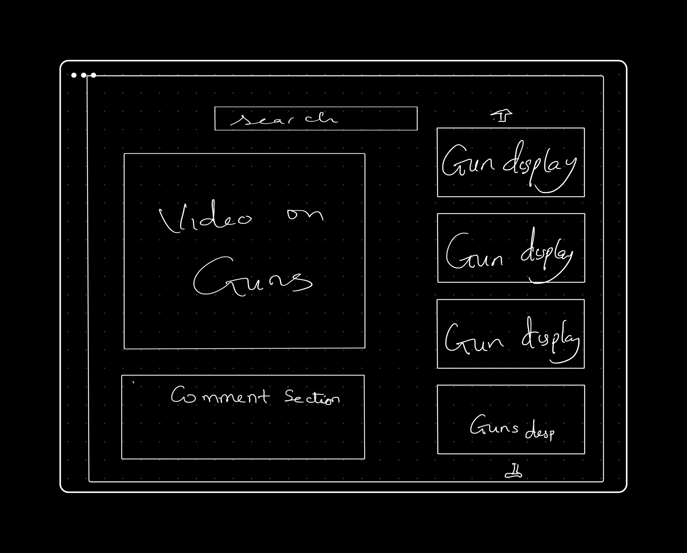

# CreaTube

## Project Idea
CreaTube is a platform where creators upload models of games charater, gun models ideas
## User Stories

* As a user, I want to create a list of models I made 
* As a user, I want to view other designers models
* As a user, I want to be able to leave a comment on other models
* As a user, I want to delete projects and update models I've made

## API Used
https://dash.valorant-api.com/

## RESTFUL API

| HTTP METHOD (_Verb_) | URL (_Nouns_)                                   | CRUD  | Response                                       | Notes |
| -------------------- | ------------------------------------------------| ----  | ---------------------------------------------- | ----- |
| GET                  |  /gunmodel                                      | GET   | list of gunmodels                              |       |
| GET                  |  /gunmodel/:id                                  | GET   | get a specific new gunmodel                    |       |
| GET                  |  /gunmodel/new                                  | GET   | a form to a new gun model                      |       |
| POST                 |  /gunmodel                                      |CREATE | create a new gun model with the post data      |       |
| GET                  |  /gunmodel/:id                                  | GET   | an update forn to a gun model                  |       |
| PUT/PATCH            |  /gunmodel/:id                                  |UPDATE | updated gun model                              |       |
| DELETE               |  /gunmodel/:id                                  |DESTROY| destroy a gun model                            |       |

## ER Diagram

## Wireframe

## MVP Checklist
* A home page that user can navigate to other routes
* A Page for displaying creators ideas
* A comment section for a model
* Have a gun and characters model
* A users created model and favorite model

## Stretch Goal
* Characters Model
* A like, dislike and subscribe section
* Have other models (gears, perks)
