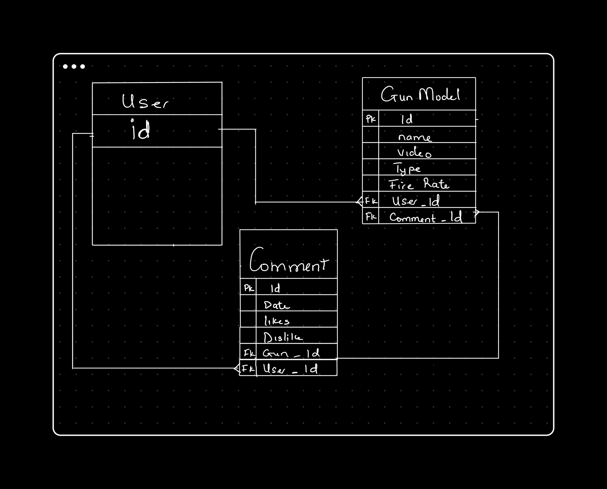

# CreaTube

## Project Idea

CreaTube is a Platform created for displaying weapons stats, skins and videos for a free-to-play first-person hero shooter game developed and published by Riot Games, for Microsoft Windows. It makes uses of the API https://dash.valorant-api.com/ to populate it's data to the webpage

## User Stories

* As a user, I want to make a favorite a models(weapoms,gears...)
* As a user, I want to view all weapons present in the game
* As a user, I want to be able to leave a like on weapon models
* As a user, I want to delete a weapon model from my favorite list and update the list I've made

## API Used

https://dash.valorant-api.com/

## Link to deployed site
creatube-jamesonwordi.koyeb.app/

## RESTFUL API

| HTTP METHOD (_Verb_) | URL (_Nouns_)                              | CRUD  | Response                                              | Notes |
| -------------------- | -------------------------------------------| ----  | ----------------------------------------------------- | ----- |
| GET                  |  /users/profile                            | GET   | route to profiles page                                |       |
| GET                  |  /users/armory                             | GET   | list of all weapons.                                  |       |
| GET                  |  /users/armory/:id                         | GET   | get a specific new weapon stats                       |       |
| POST                 |  /users/armory/:id                         |CREATE | add a new weapon model to favorite list               |       |
| GET                  |  /users/favorite                           | GET   | list of all favorite weapons                          |       |
| DELETE               |  /users/favorite/:id                       |DESTROY| remove a weapon from favorite model                   |       |
| GET                  |  /users/favorite/skins                     | GET   | get all skins of a specific weapon                    |       |
| PUT/PATCH            |  /users/favorite/skins/:id                 |UPDATE | updated a favorite weapon's skin                      |       |
| GET                  |  /users/images                             | GET   | list of all weapons skin images                       |       |
| GET                  |  /users/videos                             | GET   | list of all weapons skin videos                       |       |
| GET                  |  /users/videos/:id                         | GET   | list of a specific weapons skin video                 |       |
| POST                 |  /users/videos/:id                         |CREATE | add reaction to a weapon's skin from all view         |       |
| POST                 |  /users/videos/:id                         |CREATE | add reaction to a weapon's skin from a specific view  |       |

## ER Diagram

## Wireframe

## MVP Checklist

* A page that displays all weapons
* Ability to add a weapon to favorite list
* A like and dislike section for weapons videos
* Have a favorite gun and characters model

## Stretch Goal

* Characters Model
* Have other models (gears, perks)
